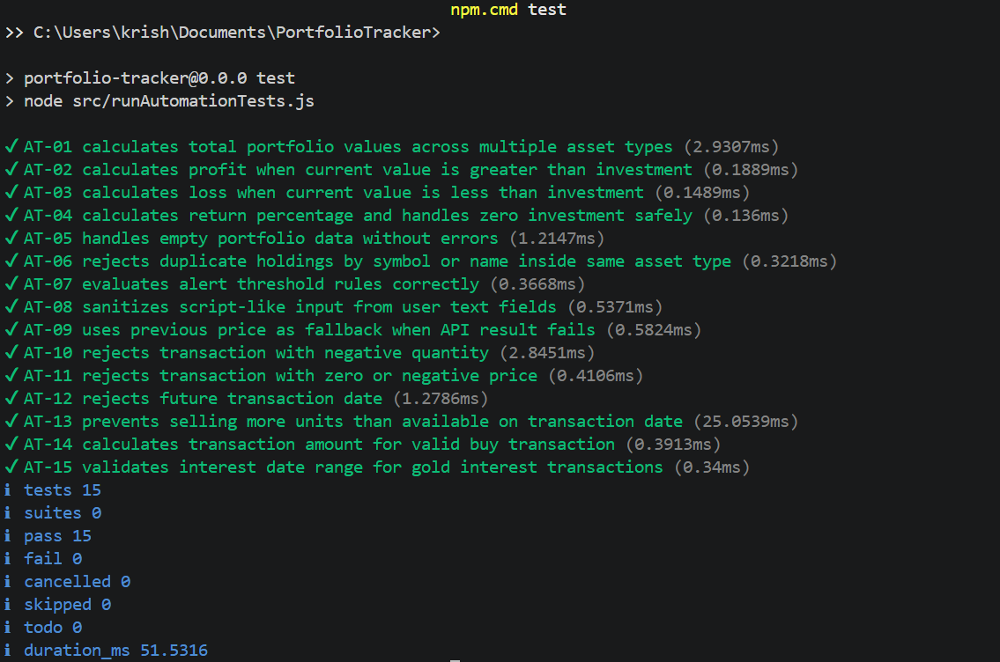

# SE PROJECT TEST SUBMISSION

**Project Title:** Portfolio Tracker  
**Subject:** Software Engineering Lab  
**Submitted By:** [Your Name / Team Members]  
**Class:** [Your Class / Section]  
**Date:** [Submission Date]

---

## MODULE 1: USER AUTHENTICATION

**Purpose:**  
This module verifies secure user access to the Portfolio Tracker application, including login, logout, and session restore functionality.

**Code Screenshot:**  
[Insert screenshot of authentication-related code here]

### Test Case 1
**Test Case ID:** MT-01  
**Test Scenario:** Login page loads for signed-out user  
**Steps:** Open app while logged out  
**Expected Result:** Login screen appears with Google sign-in button  
**Actual Result:** Login screen appeared with Google sign-in button  
**Status:** Pass  
[Insert output screenshot here]

### Test Case 2
**Test Case ID:** MT-02  
**Test Scenario:** Google sign-in works  
**Steps:** Click Sign in with Google and complete authentication  
**Expected Result:** User lands on dashboard with portfolio header  
**Actual Result:** User landed on dashboard successfully  
**Status:** Pass  
[Insert output screenshot here]

### Test Case 3
**Test Case ID:** MT-03  
**Test Scenario:** Logout works  
**Steps:** Click Logout  
**Expected Result:** User session ends and login page returns  
**Actual Result:** User session ended and login page returned  
**Status:** Pass  
[Insert output screenshot here]

### Test Case 4
**Test Case ID:** MT-04  
**Test Scenario:** Session restore works  
**Steps:** Login, then refresh the page  
**Expected Result:** User remains logged in and app reloads data  
**Actual Result:** Session remained active and data reloaded correctly  
**Status:** Pass  
[Insert output screenshot here]

**Errors (if any):**  
No errors found.

**Final Module Status:**  
Pass

---

## MODULE 2: DASHBOARD, SAMPLE DATA, HEADER AND NOTES

**Purpose:**  
This module checks the dashboard interface, sample data loading, top navigation controls, refresh behavior, and notes functionality.

**Code Screenshot:**  
[Insert screenshot of dashboard/header/notes code here]

### Test Case 1
**Test Case ID:** MT-05  
**Test Scenario:** Empty-state Load Data option shows  
**Steps:** Login with account with no data  
**Expected Result:** Empty portfolio prompt and sample-data CTA appear  
**Actual Result:** Empty-state prompt and CTA appeared correctly  
**Status:** Pass  
[Insert output screenshot here]

### Test Case 2
**Test Case ID:** MT-06  
**Test Scenario:** Load sample data works  
**Steps:** Click Load Sample Data  
**Expected Result:** Mock/sample holdings and transactions appear  
**Actual Result:** Sample holdings and transactions appeared correctly  
**Status:** Pass  
[Insert output screenshot here]

### Test Case 3
**Test Case ID:** MT-07  
**Test Scenario:** Mock data banner shown  
**Steps:** After loading sample data  
**Expected Result:** Banner indicates mock-data mode  
**Actual Result:** Mock-data banner displayed correctly  
**Status:** Pass  
[Insert output screenshot here]

### Test Case 4
**Test Case ID:** MT-08  
**Test Scenario:** Manage disabled in mock mode  
**Steps:** Try Manage Transactions with sample data  
**Expected Result:** Manage action disabled with tooltip/message  
**Actual Result:** Manage action was disabled as expected  
**Status:** Pass  
[Insert output screenshot here]

### Test Case 5
**Test Case ID:** MT-09  
**Test Scenario:** Dashboard button navigation works  
**Steps:** From non-home page, click Dashboard  
**Expected Result:** Returns to home/dashboard  
**Actual Result:** Navigation returned to dashboard correctly  
**Status:** Pass  
[Insert output screenshot here]

### Test Case 6
**Test Case ID:** MT-10  
**Test Scenario:** Refresh prices button works  
**Steps:** Click Refresh  
**Expected Result:** Loading overlay appears, then prices update  
**Actual Result:** Loading overlay appeared and prices updated correctly  
**Status:** Pass  
[Insert output screenshot here]

### Test Case 7
**Test Case ID:** MT-11  
**Test Scenario:** Last updated timer shown  
**Steps:** Refresh prices and wait  
**Expected Result:** "Updated Xs/Xm ago" text updates over time  
**Actual Result:** Timer text updated correctly over time  
**Status:** Pass  
[Insert output screenshot here]

### Test Case 8
**Test Case ID:** MT-12  
**Test Scenario:** Notes modal opens  
**Steps:** Click Take Notes  
**Expected Result:** Notes modal opens  
**Actual Result:** Notes modal opened successfully  
**Status:** Pass  
[Insert output screenshot here]

### Test Case 9
**Test Case ID:** MT-13  
**Test Scenario:** Notes save works  
**Steps:** Enter notes and save  
**Expected Result:** Notes persist after reopen/reload  
**Actual Result:** Notes persisted successfully after reopen/reload  
**Status:** Pass  
[Insert output screenshot here]

**Errors (if any):**  
No errors found.

**Final Module Status:**  
Pass

---

## MODULE 3: DASHBOARD ANALYTICS, DETAIL PAGE AND PERFORMANCE

**Purpose:**  
This module validates the main portfolio dashboard metrics, charts, detail pages, navigation, and performance visualization features.

**Code Screenshot:**  
[Insert screenshot of dashboard analytics/detail page/performance code here]

### Test Case 1
**Test Case ID:** MT-14  
**Test Scenario:** Account overview cards render correctly  
**Steps:** Open dashboard with holdings  
**Expected Result:** Investment, value, gains, and returns cards show valid numbers  
**Actual Result:** Overview cards displayed valid numbers  
**Status:** Pass  
[Insert output screenshot here]

### Test Case 2
**Test Case ID:** MT-15  
**Test Scenario:** Allocation chart renders  
**Steps:** Open dashboard with holdings  
**Expected Result:** Pie chart renders without overlap/errors  
**Actual Result:** Pie chart rendered correctly without issues  
**Status:** Pass  
[Insert output screenshot here]

### Test Case 3
**Test Case ID:** MT-16  
**Test Scenario:** Asset summary drill-down works  
**Steps:** Click asset row  
**Expected Result:** Navigates to detail page for that asset type  
**Actual Result:** Asset drill-down opened the correct detail page  
**Status:** Pass  
[Insert output screenshot here]

### Test Case 4
**Test Case ID:** MT-17  
**Test Scenario:** Back to Home works  
**Steps:** Open detail page and click Back  
**Expected Result:** Returns to dashboard  
**Actual Result:** Returned to dashboard successfully  
**Status:** Pass  
[Insert output screenshot here]

### Test Case 5
**Test Case ID:** MT-18  
**Test Scenario:** Holdings table renders  
**Steps:** Open stock, mutual fund, or gold detail page  
**Expected Result:** Relevant holdings appear with correct columns  
**Actual Result:** Holdings table displayed correctly  
**Status:** Pass  
[Insert output screenshot here]

### Test Case 6
**Test Case ID:** MT-19  
**Test Scenario:** Return toggle works  
**Steps:** Click Return % / currency header  
**Expected Result:** Values switch between percentage and currency  
**Actual Result:** Values switched correctly  
**Status:** Pass  
[Insert output screenshot here]

### Test Case 7
**Test Case ID:** MT-20  
**Test Scenario:** Holding transaction drill-down works  
**Steps:** Click holding row  
**Expected Result:** Transaction history page opens for that holding  
**Actual Result:** Transaction history page opened correctly  
**Status:** Pass  
[Insert output screenshot here]

### Test Case 8
**Test Case ID:** MT-21  
**Test Scenario:** Performance chart renders  
**Steps:** Open detail page  
**Expected Result:** Benchmark/performance chart loads  
**Actual Result:** Performance chart loaded successfully  
**Status:** Pass  
[Insert output screenshot here]

### Test Case 9
**Test Case ID:** MT-22  
**Test Scenario:** Period filters work  
**Steps:** Switch 1M, 1Y, All, etc.  
**Expected Result:** Chart refreshes for selected period  
**Actual Result:** Chart updated correctly for each selected period  
**Status:** Pass  
[Insert output screenshot here]

### Test Case 10
**Test Case ID:** MT-23  
**Test Scenario:** Graph toggles work  
**Steps:** Toggle Sensex, Nifty, Portfolio, etc.  
**Expected Result:** Corresponding lines show/hide  
**Actual Result:** Graph lines toggled correctly  
**Status:** Pass  
[Insert output screenshot here]

**Errors (if any):**  
No errors found.

**Final Module Status:**  
Pass

---

## MODULE 4: PORTFOLIO AND TRANSACTION MANAGEMENT

**Purpose:**  
This module checks category selection, new holding creation, transaction handling, validations, transaction history, and bank account management.

**Code Screenshot:**  
[Insert screenshot of manage page and transaction form code here]

### Test Case 1
**Test Case ID:** MT-24  
**Test Scenario:** Manage page loads  
**Steps:** Open Manage Transactions  
**Expected Result:** Category/Holding card and controls render  
**Actual Result:** Manage page loaded correctly  
**Status:** Pass  
[Insert output screenshot here]

### Test Case 2
**Test Case ID:** MT-25  
**Test Scenario:** Mobile category dropdown stays inside card  
**Steps:** On small viewport, open category dropdown  
**Expected Result:** Dropdown stays within frame/card width  
**Actual Result:** Dropdown stayed within the card area  
**Status:** Pass  
[Insert output screenshot here]

### Test Case 3
**Test Case ID:** MT-26  
**Test Scenario:** Mobile holding dropdown stays inside card  
**Steps:** On small viewport, open holding dropdown  
**Expected Result:** Dropdown stays within frame/card width  
**Actual Result:** Dropdown stayed within the card area  
**Status:** Pass  
[Insert output screenshot here]

### Test Case 4
**Test Case ID:** MT-27  
**Test Scenario:** Mobile dropdown colors match UI  
**Steps:** Open custom mobile dropdown  
**Expected Result:** Background/text stay light and readable  
**Actual Result:** Dropdown colors matched UI and remained readable  
**Status:** Pass  
[Insert output screenshot here]

### Test Case 5
**Test Case ID:** MT-28  
**Test Scenario:** Select category updates holdings list  
**Steps:** Choose Stock, MF, Gold, or Bank  
**Expected Result:** Holding selector updates to matching holdings only  
**Actual Result:** Holdings list updated correctly based on category  
**Status:** Pass  
[Insert output screenshot here]

### Test Case 6
**Test Case ID:** MT-29  
**Test Scenario:** Add-new option appears  
**Steps:** Choose category  
**Expected Result:** Add New <Type> option is available  
**Actual Result:** Add New option appeared correctly  
**Status:** Pass  
[Insert output screenshot here]

### Test Case 7
**Test Case ID:** MT-30  
**Test Scenario:** New holding form appears  
**Steps:** Select Add New option  
**Expected Result:** Form opens with relevant fields  
**Actual Result:** New holding form opened correctly  
**Status:** Pass  
[Insert output screenshot here]

### Test Case 8
**Test Case ID:** MT-31  
**Test Scenario:** Stock new holding validation  
**Steps:** Add stock with invalid symbol/name  
**Expected Result:** Invalid values blocked or rejected with message  
**Actual Result:** Invalid input was blocked correctly  
**Status:** Pass  
[Insert output screenshot here]

### Test Case 9
**Test Case ID:** MT-32  
**Test Scenario:** Mutual fund new holding validation  
**Steps:** Add mutual fund without category  
**Expected Result:** Save blocked with validation error  
**Actual Result:** Validation blocked save correctly  
**Status:** Pass  
[Insert output screenshot here]

### Test Case 10
**Test Case ID:** MT-33  
**Test Scenario:** Gold new holding validation  
**Steps:** Add gold with missing required fields  
**Expected Result:** Save blocked with validation error  
**Actual Result:** Validation blocked save correctly  
**Status:** Pass  
[Insert output screenshot here]

### Test Case 11
**Test Case ID:** MT-34  
**Test Scenario:** Bank balance form works  
**Steps:** Add new bank entry  
**Expected Result:** Bank balance holding saved correctly  
**Actual Result:** Bank balance entry saved successfully  
**Status:** Pass  
[Insert output screenshot here]

### Test Case 12
**Test Case ID:** MT-35  
**Test Scenario:** Buy transaction save works  
**Steps:** Add valid buy transaction  
**Expected Result:** Transaction saved and reflected in holding stats  
**Actual Result:** Buy transaction saved and stats updated correctly  
**Status:** Pass  
[Insert output screenshot here]

### Test Case 13
**Test Case ID:** MT-36  
**Test Scenario:** Sell transaction save works  
**Steps:** Add valid sell transaction  
**Expected Result:** Quantity/cost/value update correctly  
**Actual Result:** Sell transaction updated values correctly  
**Status:** Pass  
[Insert output screenshot here]

### Test Case 14
**Test Case ID:** MT-37  
**Test Scenario:** Dividend transaction save works  
**Steps:** Add dividend for stock/MF  
**Expected Result:** Income reflected without changing quantity  
**Actual Result:** Dividend saved correctly and quantity remained unchanged  
**Status:** Pass  
[Insert output screenshot here]

### Test Case 15
**Test Case ID:** MT-38  
**Test Scenario:** Gold interest transaction save works  
**Steps:** Add gold interest with dates  
**Expected Result:** Interest saved and displayed correctly  
**Actual Result:** Gold interest transaction worked correctly  
**Status:** Pass  
[Insert output screenshot here]

### Test Case 16
**Test Case ID:** MT-39  
**Test Scenario:** Edit transaction works  
**Steps:** Edit an existing transaction and save  
**Expected Result:** Updated values appear in list and totals  
**Actual Result:** Edited transaction updated correctly  
**Status:** Pass  
[Insert output screenshot here]

### Test Case 17
**Test Case ID:** MT-40  
**Test Scenario:** Delete transaction works  
**Steps:** Delete a transaction  
**Expected Result:** Transaction removed and stats recalculate  
**Actual Result:** Transaction was deleted and statistics recalculated correctly  
**Status:** Pass  
[Insert output screenshot here]

### Test Case 18
**Test Case ID:** MT-41  
**Test Scenario:** Holding history pagination works  
**Steps:** Use Show selector buttons  
**Expected Result:** Page count and rows update correctly  
**Actual Result:** Pagination updated rows and count correctly  
**Status:** Pass  
[Insert output screenshot here]

### Test Case 19
**Test Case ID:** MT-42  
**Test Scenario:** History table columns correct by type  
**Steps:** Open stock, MF, and gold histories  
**Expected Result:** Type-specific labels/columns appear correctly  
**Actual Result:** History table columns were correct for each type  
**Status:** Pass  
[Insert output screenshot here]

### Test Case 20
**Test Case ID:** MT-43  
**Test Scenario:** Existing bank account shows balance  
**Steps:** Select bank holding  
**Expected Result:** Current balance is shown clearly  
**Actual Result:** Bank balance displayed clearly  
**Status:** Pass  
[Insert output screenshot here]

### Test Case 21
**Test Case ID:** MT-44  
**Test Scenario:** Update balance works  
**Steps:** Edit bank balance  
**Expected Result:** Balance updates and persists  
**Actual Result:** Balance updated and persisted correctly  
**Status:** Pass  
[Insert output screenshot here]

### Test Case 22
**Test Case ID:** MT-45  
**Test Scenario:** Delete bank works  
**Steps:** Delete bank account  
**Expected Result:** Holding and associated transactions are removed  
**Actual Result:** Bank account and related transactions were removed correctly  
**Status:** Pass  
[Insert output screenshot here]

**Errors (if any):**  
No errors found.

**Final Module Status:**  
Pass

---

## MODULE 5: PRICE ALERTS

**Purpose:**  
This module validates creation, validation, deletion, and manual checking of portfolio alerts.

**Code Screenshot:**  
[Insert screenshot of alert management code here]

### Test Case 1
**Test Case ID:** MT-46  
**Test Scenario:** Open alert form  
**Steps:** On Manage page for non-bank type, click Set Alert  
**Expected Result:** Alert form appears  
**Actual Result:** Alert form opened successfully  
**Status:** Pass  
[Insert output screenshot here]

### Test Case 2
**Test Case ID:** MT-47  
**Test Scenario:** Save valid alert  
**Steps:** Select holding, direction, target, and save  
**Expected Result:** Alert saved and shown in list  
**Actual Result:** Alert saved and displayed correctly  
**Status:** Pass  
[Insert output screenshot here]

### Test Case 3
**Test Case ID:** MT-48  
**Test Scenario:** Alert validation works  
**Steps:** Try saving with missing fields  
**Expected Result:** Save blocked with message  
**Actual Result:** Validation blocked alert save correctly  
**Status:** Pass  
[Insert output screenshot here]

### Test Case 4
**Test Case ID:** MT-49  
**Test Scenario:** Delete alert works  
**Steps:** Delete an alert  
**Expected Result:** Alert disappears from list  
**Actual Result:** Alert deleted successfully  
**Status:** Pass  
[Insert output screenshot here]

### Test Case 5
**Test Case ID:** MT-50  
**Test Scenario:** Check alerts manually  
**Steps:** Click Check Now  
**Expected Result:** Threshold check runs and success message appears  
**Actual Result:** Manual alert check completed successfully  
**Status:** Pass  
[Insert output screenshot here]

**Errors (if any):**  
No errors found.

**Final Module Status:**  
Pass

---

## MODULE 6: RESPONSIVENESS, KEYBOARD, PERSISTENCE, ERROR HANDLING, SECURITY AND AI ADVISOR

**Purpose:**  
This module validates system behavior across device sizes, keyboard protection, cached reloads, safe failure handling, input safety, and AI advisor display.

**Code Screenshot:**  
[Insert screenshot of responsive/error/security/advisor-related code here]

### Test Case 1
**Test Case ID:** MT-51  
**Test Scenario:** Small-screen layout overall  
**Steps:** Test approximately 320px width  
**Expected Result:** No major overflow/clipping in key sections  
**Actual Result:** Layout remained usable without major overflow  
**Status:** Pass  
[Insert output screenshot here]

### Test Case 2
**Test Case ID:** MT-52  
**Test Scenario:** Tablet layout  
**Steps:** Test approximately 768px width  
**Expected Result:** Controls align well and remain usable  
**Actual Result:** Tablet layout remained aligned and usable  
**Status:** Pass  
[Insert output screenshot here]

### Test Case 3
**Test Case ID:** MT-53  
**Test Scenario:** Desktop layout  
**Steps:** Test large screen  
**Expected Result:** Tables, charts, and controls look normal  
**Actual Result:** Desktop layout displayed correctly  
**Status:** Pass  
[Insert output screenshot here]

### Test Case 4
**Test Case ID:** MT-54  
**Test Scenario:** Refresh shortcut blocked  
**Steps:** Press F5 or Ctrl/Cmd + R  
**Expected Result:** App blocks shortcut and shows warning  
**Actual Result:** Shortcut was blocked and warning displayed  
**Status:** Pass  
[Insert output screenshot here]

### Test Case 5
**Test Case ID:** MT-55  
**Test Scenario:** Cached data reload  
**Steps:** Load data, then refresh app  
**Expected Result:** Holdings/transactions reload without corruption  
**Actual Result:** Cached data reloaded correctly  
**Status:** Pass  
[Insert output screenshot here]

### Test Case 6
**Test Case ID:** MT-56  
**Test Scenario:** API/network failure handling  
**Steps:** Simulate failed price fetch or offline state  
**Expected Result:** App shows safe fallback and does not crash  
**Actual Result:** Application handled failure safely without crashing  
**Status:** Pass  
[Insert output screenshot here]

### Test Case 7
**Test Case ID:** MT-57  
**Test Scenario:** Input sanitization basic check  
**Steps:** Enter HTML/script-like input in text fields  
**Expected Result:** Unsafe characters/scripts are stripped or blocked  
**Actual Result:** Unsafe input was blocked or sanitized correctly  
**Status:** Pass  
[Insert output screenshot here]

### Test Case 8
**Test Case ID:** MT-58  
**Test Scenario:** AI advisor widget displays  
**Steps:** Open app with holdings  
**Expected Result:** AI advisor appears without layout break  
**Actual Result:** AI advisor displayed correctly without layout issues  
**Status:** Pass  
[Insert output screenshot here]

**Errors (if any):**  
No errors found.

**Final Module Status:**  
Pass

---

## AUTOMATION TESTING REPORT

**Purpose:**  
Automation testing was performed to verify internal project logic, calculation accuracy, validation rules, alert behavior, input safety, and fallback handling. These test cases are different from the manual UI test cases, so they support the manual testing report without repeating the same checks.

**Testing Tool Used:**  
Node.js built-in test runner and Selenium WebDriver with ChromeDriver

**Browser Automation Used For Recording:**  
Selenium WebDriver opens the actual Portfolio Tracker React website, selects the Manage Transactions module, auto-fills transaction values, clicks Save, and verifies validation messages.

**Command Used:**  
`npm test`

**Browser Automation Command Used:**  
`npm run test:selenium`

**Automation Testing Tech Stack:**  
React, Vite, JavaScript, Node.js built-in test runner, Node Assert module, Selenium WebDriver protocol, Google Chrome, and ChromeDriver.

**Selenium Browser Automation Test Cases Used For Video Recording:**  
AT-S01: Selenium opens the actual Portfolio Tracker website, selects Manage Transactions, fills a valid buy transaction, clicks Save, and verifies the success alert.  
AT-S02: Selenium fills a negative quantity, clicks Save, and verifies the quantity validation alert.  
AT-S03: Selenium fills zero price, clicks Save, and verifies the price validation alert.  
AT-S04: Selenium fills a future date, clicks Save, and verifies the future-date validation alert.

**Automation Code Screenshots:**  
[Insert screenshot of `src/portfolioLogic.test.js` here]  
[Insert screenshot of `src/validationForManageTransactionPage.test.js` here]

**Test Execution Screenshot:**  

### Automation Test Case 1
**Test Case ID:** AT-01  
**Module:** Portfolio Calculation  
**Test Scenario:** Calculate total portfolio values across multiple asset types  
**Expected Result:** Total cost, current value, income, gain, and return percentage should be calculated correctly  
**Actual Result:** Portfolio totals were calculated correctly  
**Status:** Pass

### Automation Test Case 2
**Test Case ID:** AT-02  
**Module:** Profit / Loss Calculation  
**Test Scenario:** Calculate profit when current value is greater than investment  
**Expected Result:** Profit amount should be positive and accurate  
**Actual Result:** Profit amount was calculated correctly  
**Status:** Pass

### Automation Test Case 3
**Test Case ID:** AT-03  
**Module:** Profit / Loss Calculation  
**Test Scenario:** Calculate loss when current value is less than investment  
**Expected Result:** Loss amount should be calculated correctly  
**Actual Result:** Loss amount was calculated correctly  
**Status:** Pass

### Automation Test Case 4
**Test Case ID:** AT-04  
**Module:** Return Percentage Calculation  
**Test Scenario:** Calculate return percentage and handle zero investment safely  
**Expected Result:** Return percentage should be accurate and zero investment should not cause an error  
**Actual Result:** Return percentage and zero investment handling worked correctly  
**Status:** Pass

### Automation Test Case 5
**Test Case ID:** AT-05  
**Module:** Portfolio Data Handling  
**Test Scenario:** Handle empty portfolio data without errors  
**Expected Result:** Empty portfolio should return zero values without crashing  
**Actual Result:** Empty portfolio was handled safely  
**Status:** Pass

### Automation Test Case 6
**Test Case ID:** AT-06  
**Module:** Holding Management  
**Test Scenario:** Reject duplicate holdings by symbol or name inside the same asset type  
**Expected Result:** Duplicate holding should not be allowed  
**Actual Result:** Duplicate holding was rejected successfully  
**Status:** Pass

### Automation Test Case 7
**Test Case ID:** AT-07  
**Module:** Alert Logic  
**Test Scenario:** Evaluate alert threshold rules correctly  
**Expected Result:** Alert should trigger only when the target condition is met  
**Actual Result:** Alert threshold rules worked correctly  
**Status:** Pass

### Automation Test Case 8
**Test Case ID:** AT-08  
**Module:** Input Sanitization  
**Test Scenario:** Sanitize script-like input from user text fields  
**Expected Result:** Unsafe characters and script patterns should be removed or blocked  
**Actual Result:** Unsafe input was sanitized successfully  
**Status:** Pass

### Automation Test Case 9
**Test Case ID:** AT-09  
**Module:** API Fallback Handling  
**Test Scenario:** Use previous price as fallback when API result fails  
**Expected Result:** System should use the previous price and avoid crashing  
**Actual Result:** Fallback price handling worked correctly  
**Status:** Pass

### Automation Test Case 10
**Test Case ID:** AT-10  
**Module:** Transaction Validation  
**Test Scenario:** Reject transaction with negative quantity  
**Expected Result:** System should reject negative quantity and show validation error  
**Actual Result:** Negative quantity was rejected successfully  
**Status:** Pass

### Automation Test Case 11
**Test Case ID:** AT-11  
**Module:** Transaction Validation  
**Test Scenario:** Reject transaction with zero or negative price  
**Expected Result:** System should reject invalid price  
**Actual Result:** Invalid price was rejected successfully  
**Status:** Pass

### Automation Test Case 12
**Test Case ID:** AT-12  
**Module:** Transaction Validation  
**Test Scenario:** Reject future transaction date  
**Expected Result:** System should not allow future-dated transactions  
**Actual Result:** Future transaction date was rejected successfully  
**Status:** Pass

### Automation Test Case 13
**Test Case ID:** AT-13  
**Module:** Transaction Validation  
**Test Scenario:** Prevent selling more units than available on transaction date  
**Expected Result:** System should block sell transaction if quantity is greater than available holding quantity  
**Actual Result:** Excess sell quantity was blocked successfully  
**Status:** Pass

### Automation Test Case 14
**Test Case ID:** AT-14  
**Module:** Transaction Calculation  
**Test Scenario:** Calculate transaction amount for valid buy transaction  
**Expected Result:** Amount should equal quantity multiplied by price  
**Actual Result:** Transaction amount was calculated correctly  
**Status:** Pass

### Automation Test Case 15
**Test Case ID:** AT-15  
**Module:** Gold Transaction Validation  
**Test Scenario:** Validate interest date range for gold interest transactions  
**Expected Result:** Interest end date should be after interest start date  
**Actual Result:** Invalid interest date range was rejected successfully  
**Status:** Pass

**Automation Test Execution Summary:**  
Total Automation Test Cases: 15  
Passed: 15  
Failed: 0  
Final Automation Testing Status: Pass

**Errors (if any):**  
No errors found.

---

## CONCLUSION

The modules of the project **Portfolio Tracker** were tested successfully using both manual testing and automation testing. Manual testing was used to verify user interface flow and module behavior. Automation testing was used to verify internal logic such as calculations, validation rules, alert threshold checks, input sanitization, fallback handling, and edge cases. According to the current test results, all manual and automation test cases passed successfully.

---

## SCREENSHOT CHECKLIST

Use this checklist before submitting the final PDF:

1. Add one clear code screenshot for every module.
2. Add screenshots for the main passing test cases under each module.
3. If any error occurred during demo/testing, include the error screenshot under that module.
4. If no error occurred, keep `No errors found` as written.
5. Export the final document as PDF before submission.
